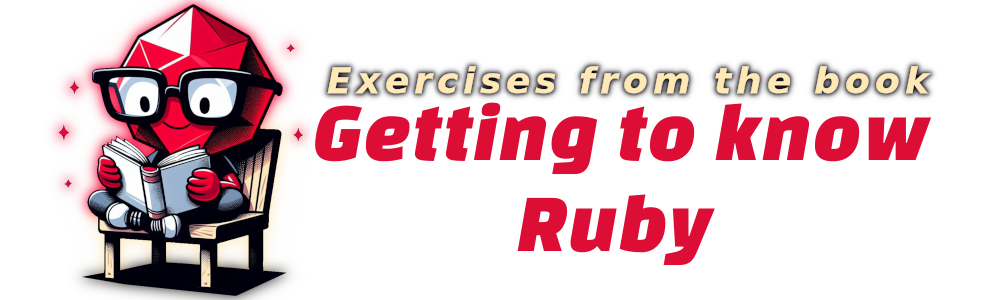
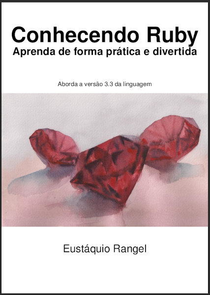

# Ruby Book Study

<!-- 
    Logo image generated by Bing IA: https://www.bing.com/images/create/
    Prompt: Image of a red Ruby similar to the symbol of the Ruby programming language, wearing glasses, sitting on a simple chair, attentively reading a white-covered book. Drawing in comic book style, flat colors, white background for easy removal.
-->

<!-- 
    icons by:
    https://devicon.dev/
    https://simpleicons.org/
-->
      

<!--
 

  
-->

 <!---->

---

## 🕸️ Found me in Web

     

---

## 📁 The Project

### ⤴️ index

__[Ruby Blog](#ruby-book)__ 
  1. ⤴️ [Index](#index)
  2. 📗 [About](#about)
  3. 💻 [Run the Project](#run)
  4. 🤖 [Use of AI](#ia)
 
 

---

### 📗 About

| Book Cover | About Book |
|-------|-------|
|| Study repository with exercise snippets executed during the reading of the free book [Conhecendo Ruby](https://leanpub.com/conhecendo-ruby). I had the need to add this language to my toolkit due to recent challenges and will use the books by the author [Eustáquio Rangel](https://eustaquiorangel.com/livros), as well as documentation, courses, and videos as a basis in this initial moment.|

 

[⤴️ Back to Index](#index)

---

### 💻 Run the Project

-  Created and tested on Ubuntu 22.04.4 LTS

  - [ Ruby Version: 3.2.3 Install Ruby Instructions](https://www.ruby-lang.org/en/documentation/installation/#apt) with [rbenv](https://github.com/rbenv/rbenv) (one of the suggestions in the book)

  - [ Instaling Rubocop and configure on VScode](https://stackoverflow.com/questions/53367947/rubocop-on-vscode-not-working-error-rubocop-is-not-executable)

 

The project was built using exercises, examples, and code snippets from the book for language practice purposes. These codes are divided within the [chapters](./chapters) folder. 
With Ruby properly installed, you can run the command `ruby filename.rb` and see the output in your console of the book exercises. The [chapters](./chapters) folder is divided as follows:

- [Chapters](./chapters)
  - [Chapter 03](./chapters/chapter-03) - The basics of language and Methods
  - [Chapter 04](./chapters/chapter-04) - Classes and Objects
  - [Chapter 05](./chapters/chapter-05) - Modules
  - Chapter 06 - RubyGems
  - Chapter 07 - Threads

 

[⤴️ Back to Index](#index)

---

### 🤖 Use of AI

The header figures on this page were created with the help of artificial intelligence and a minimum of retouching and construction in Gimp 

__The following prompts were used for creation in [Bing IA:](https://www.bing.com/images/create/)__

  
<b>Ruby Cartoon</b>

"Image of a red Ruby similar to the symbol of the Ruby programming language, wearing glasses, sitting on a simple chair, attentively reading a white-covered book. Drawing in comic book style, flat colors, white background for easy removal."<b>(sic)</b>

 

AI also helped in some research in this study by being used as a support tool; however, __arts and development are, above all, human creative activities. Value people!__

Hire artists for commercial or more elaborate projects and Learn Ingenuity!

 

[⤴️ Back to Index](#index)

<!-- 
lambda { @conversation.conversation_executions } status: 'supervision'

docker compose up postgres redis mailhog -d

yarn run build:watch

DATABASE_PORT=5435 DATABASE_ENDPOINT=postgres REDIS_URL=redis://redis:6379/0  CABLE_REDIS_URL=redis://redis:6379/1 RUBY_YJIT_ENABLE=1 RAILS_MAX_THREADS=20 bin/rails s

admin@dev.com | admin@123
-->