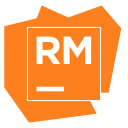

# Ruby Book Study

<!-- 
    Logo image generated by Bing IA: https://www.bing.com/images/create/
    Prompt: Image of a red Ruby similar to the symbol of the Ruby programming language, wearing glasses, sitting on a simple chair, attentively reading a white-covered book. Drawing in comic book style, flat colors, white background for easy removal.
-->

<!-- 
    icons by:
    https://devicon.dev/
    https://simpleicons.org/
-->
       

<!--
 

  
-->

 <!---->

---

## 🕸️ Found me in Web

     

---

## 📁 The Project

### ⤴️ index

__[Ruby Blog](#ruby-book)__ 
  1. ⤴️ [Index](#index)
  2. 📗 [About](#about)
  3. 💻 [Run the Project](#run)
  4. 📊 [Diagrams](#diagrams)
  5. 🤖 [Use of AI](#ia)
 
 

---

### 📗 About

#### TODO

 

[⤴️ Back to Index](#index)

---

### 💻 Run the Project

#### TODO

 

[⤴️ Back to Index](#index)

---

### 🤖 Use of AI

The header figures on this page were created with the help of artificial intelligence and a minimum of retouching and construction in Gimp 

__The following prompts were used for creation in [Bing IA:](https://www.bing.com/images/create/)__

  
<b>Ruby Cartoon</b>

"Image of a red Ruby similar to the symbol of the Ruby programming language, wearing glasses, sitting on a simple chair, attentively reading a white-covered book. Drawing in comic book style, flat colors, white background for easy removal."<b>(sic)</b>

 

AI also helped in some research in this study by being used as a support tool; however, __arts and development are, above all, human creative activities. Value people!__

Hire artists for commercial or more elaborate projects and Learn Ingenuity!

 

[⤴️ Back to Index](#index)